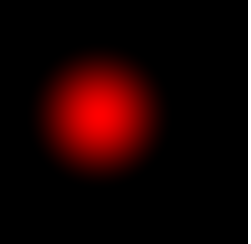

### 在线调试

`glslEditor`
地址：http://editor.thebookofshaders.com/


### 单颜色着色
```glsl
#ifdef GL_ES
//设置浮点数类型精度 
//低精度（precision lowp float;）高精度（precision highp float;）
precision mediump float;
#endif
uniform float u_time;
void main() {
	gl_FragColor = vec4(1.0,0.0,0.0,1.0);
}
```

### 动态着色
uniform变量，可以理解为cpu和gpu之间的桥梁

varying变量，用于在顶点着色器和片元着色器之间传递数据

`u_time`为外部传递的程序启动时间 ，单位s
```glsl
#ifdef GL_ES
precision mediump float;
#endif
uniform float u_time;
void main() {
    //1.根据时间计算sin，得到一个-1到1的值
    //2.取绝对值，让红色通道的值为0~1
    //3.得到一个根据时间闪烁的红色效果
    
    float perCount=2.0//控制sin函数的频率 u_time是基于每s变换，所以perCount表示为1s闪烁多少次
	gl_FragColor = vec4(abs(sin(u_time * perCount)),0.0,0.0,1.0);
}

```

### 屏幕坐标映射
`gl_FragCoord`:glsl内置变量，表示当前像素的屏幕坐标,openGl标准，画布左下角值为（0,0）
```
.x 是水平方向（从左到右）
.y 是垂直方向（从下到上）

以像素为单位，比如画布是 800x600，左下角坐标是 (1.0, 1.0)，右上角是 (800.0, 600.0)。
```


把像素坐标 映射到 0~1 之间的“相对坐标”

| 屏幕位置 | `gl_FragCoord.xy` | `除u_resolution`       | 得到 `st`       |
|----------|-------------------|-------------------------|------------------|
| 左下角   | (0, 0)            | (0 / 800, 0 / 600)      | (0.0, 0.0)       |
| 正中心   | (400, 300)        | (400 / 800, 300 / 600)  | (0.5, 0.5)       |
| 右上角   | (800, 600)        | (800 / 800, 600 / 600)  | (1.0, 1.0)       |

最终效果：
- st.x 左到右变亮（红色渐变）
- st.y 下到上变亮（绿色渐变）
- 蓝色恒定为 0
```glsl
uniform vec2 u_resolution; //画布的宽高（800.0,600.0）
uniform vec2 u_mouse;
uniform float u_time;

void main() {
	vec2 st = gl_FragCoord.xy/u_resolution;
	gl_FragColor = vec4(st.x,st.y,0.0,1.0);
}
```


根据鼠标移动的红色渐变
```glsl
#ifdef GL_ES
precision mediump float;
#endif

uniform vec2 u_resolution;//画布宽高
uniform vec2 u_mouse;//鼠标位置

void main() {
	// 将像素坐标归一化到 [0.0, 1.0]
    vec2 st = gl_FragCoord.xy / u_resolution;

    // 将鼠标坐标也归一化到 [0.0, 1.0]
    vec2 mouse = u_mouse / u_resolution;

    float d = distance(st, mouse);// 计算当前像素与当前鼠标位置之间的距离

    // 距离越近，红色越强；越远则越黑。用 smoothstep 实现渐变控制
    float red = smoothstep(0.3, 0.0, d); // 半径 0.3 内变红

    gl_FragColor = vec4(red, 0.0, 0.0, 1.0); // 红色通道随距离变化
}

```
效果：


