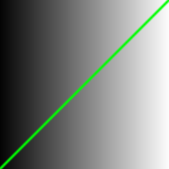

### 塑造功能

>我们将x和y的归一化位置映射到红色和绿色通道。本质上，我们创建了一个函数，它接受一个二维向量（x 和 y），并返回一个四维向量（r、g、b 和 a）。但在进一步进行维度间数据转换之前，我们需要从更简单的开始……简单得多。

在下面代码中，以两种方式可视化x坐标 ( st.x) 的标准化值：一种是用亮度（观察从黑到白的漂亮渐变），另一种是在顶部绘制一条绿线（在这种情况下，x值直接赋值给y）

```glsl
#ifdef GL_ES
precision mediump float; 
#endif

uniform vec2 u_resolution;// 画布分辨率，如 (width, height)
uniform vec2 u_mouse; // 鼠标坐标
uniform float u_time; // 当前时间s

// 使用 0.0-1.0之间的值在y上绘制一条线
//这个函数返回一个值，表示当前点 st 是否靠近对角线 y = x，如果靠近，返回接近1的值，否则为0。
//abs(st.y - st.x) 表示当前点到对角线的距离。例如左下角，像素为【0，0】，得出，
//smoothstep(0.02, 0.0, x)：当 x <= 0.0 返回 1.0，当 x >= 0.02 返回 0.0，
//平滑结果，离对角线远，颜色越淡，距离为0.0 < x < 0.02，平滑过度

Y轴
↑
|     绿色区域（线宽为 0.02，模糊程度+线宽/2）
|    /
|   /     ← 线心：st.y ≈ st.x
|  /
| /
|/
+----------→ X轴

float plot(vec2 st) {    
    return smoothstep(0.02, 0.0, abs(st.y - st.x));
}

void main() {
	vec2 st = gl_FragCoord.xy/u_resolution;//像素坐标归一化坐标到【0.0，1.0】的相对坐标 

    float y = st.x;
    //因为x取值为0~1
    //所以：color=vec3(0.0, 0.0, 0.0) 黑色~ vec3(1.0, 1.0, 1.0)白色
    //x越小越偏黑 x越大越偏白（左黑右白）
    vec3 color = vec3(y); //等同于 vec3 color = vec3(y,y,y)
    float pct = plot(st);

    //核心颜色混合 根据与线的距离，把灰度背景和绿色进行平滑混合，实现线条柔和过渡的视觉效果。
    //color 当前颜色左黑右白
    //混合颜色=（1+权重）*背景色 + 权重*高亮色
    color = (1.0-pct)*color+pct*vec3(0.0,1.0,0.0);
    //等同于
    color = mix(color, vec3(0.0, 1.0, 0.0), pct);
	gl_FragColor = vec4(color,1.0);
}

```

颜色混合计算，这里以像素点为st.x=0.5的情况，也就是在画布中间：

| pct   | (1 - pct) * gray        | pct * green           | 最终 color                     | 含义                      |
|-------|-------------------------|------------------------|----------------------------------|---------------------------|
| 0.0   | vec3(0.5, 0.5, 0.5)     | vec3(0.0, 0.0, 0.0)    | vec3(0.5, 0.5, 0.5)              | 全灰，离线远              |
| 0.25  | vec3(0.375, 0.375, 0.375) | vec3(0.0, 0.25, 0.0)   | vec3(0.375, 0.625, 0.375)        | 淡绿灰，略靠近线          |
| 0.5   | vec3(0.25, 0.25, 0.25)  | vec3(0.0, 0.5, 0.0)    | vec3(0.25, 0.75, 0.25)           | 中绿灰，线边缘            |
| 0.75  | vec3(0.125, 0.125, 0.125) | vec3(0.0, 0.75, 0.0)   | vec3(0.125, 0.875, 0.125)        | 很绿，线附近              |
| 1.0   | vec3(0.0, 0.0, 0.0)     | vec3(0.0, 1.0, 0.0)    | vec3(0.0, 1.0, 0.0)              | 纯绿，线正中              |


效果图




### 修改：

1.修改对角线为左上到右下：
>return smoothstep(0.01, 0.0, abs(st.y - (1.0 - st.x)));

2.修改为交叉线：
>float plot1 = smoothstep(0.02, 0.0, abs(st.y - st.x));              // ↗ 对角线
> 
>float plot2 = smoothstep(0.02, 0.0, abs(st.y - (1.0 - st.x)));      // ↘ 对角线
> 
>return max(plot1, plot2); // 取最亮的那条线（或改为 plot1 + plot2 叠加也行）


3.随时间绕中心点旋转的线
>float angle = u_time; // 旋转角度（单位：弧度）
> 
>mat2 rot = mat2(cos(angle), -sin(angle), sin(angle),  cos(angle));// 构造旋转后的坐标
> 
>vec2 rst = rot * (st - 0.5) + 0.5; // 围绕中心旋转，再平移回来
> 
>float pct = smoothstep(0.02, 0.0, abs(rst.y - rst.x));
> 

4.平行线
>float lines = mod(st.y - st.x, 0.1); // 每 0.1 间隔一条线
> 
>float pct = smoothstep(0.01, 0.0, abs(lines));
> 
>return pct;