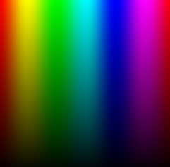
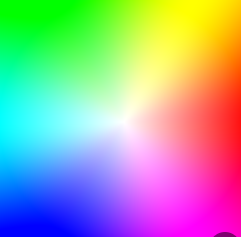

### 颜色

GLSL 中向量类型的另一个重要特性是，属性可以按任意顺序组合，这使得值转换和混合变得容易。

```glsl
vec3 yellow, magenta, green;

vec4 vector;
vector[0] = vector.r = vector.x = vector.s;
vector[1] = vector.g = vector.y = vector.t;
vector[2] = vector.b = vector.z = vector.p;
vector[3] = vector.a = vector.w = vector.q;

yellow.rg = vec2(1.0); //红色、绿色通道改为1
yellow[2] = 0.0; //蓝色通道改为0
```

### 混合颜色
mix()
>混合两个百分比值  0.0 到 1.0 之间的值  是线性插值

示例：使用正弦波随时间变化的绝对值来混合colorA和colorB。
```glsl
uniform vec2 u_resolution;
uniform float u_time;
vec3 colorA = vec3(0.149,0.141,0.912);
vec3 colorB = vec3(1.000,0.833,0.224);

void main() {
    vec3 color = vec3(0.0);

    float pct = abs(sin(u_time));//增加变化频率：u_time*x

    //mix(a, b, 0.0) = a    全是 a
    //mix(a, b, 1.0) = b    全是 b
    //mix(a, b, 0.5) = (a + b) / 2   中间
    color = mix(colorA, colorB, pct);

    gl_FragColor = vec4(color,1.0);
}

```

怎样保证两个色相差最大？
>HSV 空间中的 H（色相）角度跨度越大，mix 生成的中间颜色就越丰富
- 红（0°）→ 绿（120°） → 之间包含黄橙等丰富中间色
- 红（0°）→ 青（180°） → 中间会发灰，颜色断崖式变化

所以：红 ↔ 黄、蓝 ↔ 紫、绿 ↔ 青 是中间最丰富的组合,可以把颜色转为 HSV 空间，选定色相跨度大 + 保持饱和度 & 明度一致，然后再转回 RGB 进行 mix。


```glsl
#define PI 3.14159265359
uniform vec2 u_resolution;
uniform vec2 u_mouse;
uniform float u_time;

vec3 colorA = vec3(0.149,0.141,0.912);
vec3 colorB = vec3(1.000,0.833,0.224);

float plot (vec2 st, float pct){
  return  smoothstep( pct-0.01, pct, st.y) -
          smoothstep( pct, pct+0.01, st.y);
}

void main() {
    vec2 st = gl_FragCoord.xy/u_resolution.xy;
    vec3 color = vec3(0.0);

    vec3 pct = vec3(st.x);

    // pct.r = smoothstep(0.0,1.0, st.x);
    // pct.g = sin(st.x*PI);
    // pct.b = pow(st.x,0.5);

    color = mix(colorA, colorB, pct);

    // Plot transition lines for each channel
    color = mix(color,vec3(1.0,0.0,0.0),plot(st,pct.r));
    color = mix(color,vec3(0.0,1.0,0.0),plot(st,pct.g));
    color = mix(color,vec3(0.0,0.0,1.0),plot(st,pct.b));

    gl_FragColor = vec4(color,1.0);
}
```


### HSB
HSB代表色相 (Hue)、饱和度 (Saturation) 和亮度 (Brightness)（或称值 (Value)）

>色彩模型
- c.x → Hue（色相），范围 [0.0, 1.0]，按角度 0°～360° 映射为颜色轮

- c.y → Saturation（饱和度），0 为灰，1 为纯色

- c.z → Brightness（亮度），0 为黑，1 为全亮

```glsl
#ifdef GL_ES
precision mediump float;
#endif

uniform vec2 u_resolution;
uniform float u_time;

vec3 rgb2hsb( in vec3 c ){
    vec4 K = vec4(0.0, -1.0 / 3.0, 2.0 / 3.0, -1.0);
    vec4 p = mix(vec4(c.bg, K.wz),
                 vec4(c.gb, K.xy),
                 step(c.b, c.g));
    vec4 q = mix(vec4(p.xyw, c.r),
                 vec4(c.r, p.yzx),
                 step(p.x, c.r));
    float d = q.x - min(q.w, q.y);
    float e = 1.0e-10;
    return vec3(abs(q.z + (q.w - q.y) / (6.0 * d + e)),
                d / (q.x + e),
                q.x);
}


//hsb2rgb（Hue/Saturation/Brightness → RGB）转换的核心部分。它的思路是用数学构造出一个 RGB 向量，模拟色相环，并进行插值，最终得到一个真实 RGB 值。
c.x * 6.0：将 hue 映射到 0～6 的区间（因为色轮分为 6 个主色段）
0 → 红
1 → 黄
2 → 绿
3 → 青
4 → 蓝
5 → 紫

+ vec3(0.0, 4.0, 2.0)：用来错位 R/G/B 三个通道的相位
R 的相位从 +0.0
G 的相位从 +4.0
B 的相位从 +2.0

mod(..., 6.0)：保证值永远在 [0, 6] 区间内，形成闭环（色轮）


-3.0 → abs() → -1.0 → clamp(...)：最终构造一个三角形波形，再裁剪范围到 [0, 1]。这个过程模拟了 RGB 通道在色相转动时如何分别增强或减弱：

| Hue 角度（x） | R | G | B |
| --------- | - | - | - |
| 0         | 1 | 0 | 0 |
| 0.5       | 1 | 1 | 0 |
| 1.0       | 0 | 1 | 0 |
| 1.5       | 0 | 1 | 1 |
| 2.0       | 0 | 0 | 1 |
| 2.5       | 1 | 0 | 1 |
| 3.0       | 1 | 0 | 0 |


vec3 hsb2rgb( in vec3 c ){
    vec3 rgb = clamp(
        abs(
            mod(c.x*6.0+vec3(0.0,4.0,2.0),6.0)-3.0
        )-1.0,0.0, 1.0 );

    //smoothstep 插值函数，作用是平滑颜色边界,可以让渐变变得柔和，公式：Hermite插值公式  smooth(x) = x * x * (3 - 2x)  
    rgb = rgb*rgb*(3.0-2.0*rgb);
    
    //混合白色和色相控制饱和度
    //当 c.y = 0（饱和度为 0）时，得到的是 vec3(1.0)（白色）
    //当 c.y = 1（纯色）时，得到的是 rgb
    //中间值是线性插值
    return c.z * mix(vec3(1.0), rgb, c.y);
}

void main(){
    vec2 st = gl_FragCoord.xy/u_resolution;
    vec3 color = vec3(0.0);

    // 将x（0.0 - 1.0）映射到色调（0.0 - 1.0）
    // 将y（0.0 - 1.0）表示为亮度
    // 1.0为饱和度 不变
    color = hsb2rgb(vec3(st.x,1.0,st.y));

    gl_FragColor = vec4(color,1.0);
}

```

效果图：



### 极坐标中的HSB

极坐标常见用途
- 🌈 色环（色相圆）	color = hsb2rgb(vec3(angle/PI2, 1.0, radius))
- 🌊 水波	sin(radius * N - time)
- 🌪 扭曲	angle += sin(radius * freq)
- 🌟 辐射光	根据 angle 或 radius 阈值做渐变

```glsl

#ifdef GL_ES
precision mediump float;
#endif

#define TWO_PI 6.28318530718

uniform vec2 u_resolution;
uniform float u_time;

//in 只读  out 只写   inout 引用传递（可读可写）
vec3 hsb2rgb( in vec3 c ){
    vec3 rgb = clamp(abs(mod(c.x*6.0+vec3(0.0,4.0,2.0),
                             6.0)-3.0)-1.0,
                     0.0,
                     1.0 );
    rgb = rgb*rgb*(3.0-2.0*rgb);
    return c.z * mix( vec3(1.0), rgb, c.y);
}

void main(){
    vec2 st = gl_FragCoord.xy/u_resolution;
    vec3 color = vec3(0.0);

    // 使用极坐标代替笛卡尔坐标
    vec2 toCenter = vec2(0.5)-st; //从当前点 st 指向画布中心的向量
    float angle = atan(toCenter.y,toCenter.x);//  反正切函数，返回向量与 x 轴之间的夹角（弧度制，范围为 [-π, π]）
    //计算当前点到中心的距离 √(x² + y²)  
    // * 2.0：将 [0, 0.5 * sqrt(2)] 映射到 [0, √2] 范围，增强视觉范围或覆盖整个画布。
    float radius = length(toCenter)*2.0;

    // 将角度 (-PI - PI) 映射到色调 ( 0 - 1)
    // 饱和度与半径的关系
    // angle 为 [-π, π]  所以angle / TWO_PI 范围是 [-0.5, 0.5]  然后加0.5 范围为[0.0 ,1.0]正好对应色相H
    // 使用radius作为饱和度 越中心 饱和度为0 越远 饱和度为1
    color = hsb2rgb(vec3((angle/TWO_PI)+0.5,radius,1.0));

    gl_FragColor = vec4(color,1.0);
}

```

效果图：


