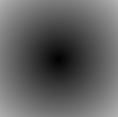
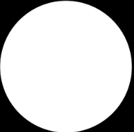
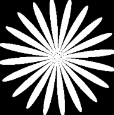
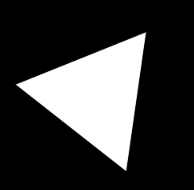

### 绘制正方形

```glsl
uniform vec2 u_resolution;

void main(){
    //将当前像素坐标 gl_FragCoord.xy 映射到 [0.0, 1.0] 的范围内，也就是归一化的屏幕坐标：
    //左下角是 (0.0, 0.0)
    //右上角是 (1.0, 1.0)
    vec2 st = gl_FragCoord.xy/u_resolution.xy;
    vec3 color = vec3(0.0);//黑色

    //step函数：
    //如果start.x<0.1 则返回0 否则返回1
    float left = step(0.1,st.x); 
    //如果start.y<0.1 则返回0 否则返回1
    float bottom = step(0.1,st.y); 

    //逻辑与
    //如果 x >= 0.1 且 y >= 0.1，那么 left = 1 且 bottom = 1，left * bottom = 1，最终颜色为白色（1.0, 1.0, 1.0）；
    //否则结果为黑色，
    color = vec3( left * bottom );

    gl_FragColor = vec4(color,1.0);
}
```

分析上述例子：
坐标系说明：
左下角 (0,0)，右上角 (1,1)，图像区域归一化到 [0,1]×[0,1]

图像渲染结果示意图（█ 表示白色区域，░ 表示黑色区域）：


到目前位置，仅仅绘制了一半的边框，现在利用反转st坐标实现类似于翻页的效果
```glsl
//下方和左边
//等同于  float left = step(0.1,st.x);  float bottom = step(0.1,st.y);  
vec2 bl = step(vec2(0.1),st);      

//上方和右边
vec2 tr = step(vec2(0.1),1.0-st);   
color = vec3(bl.x * bl.y * tr.x * tr.y);
```


练习1：改变矩形大小
```glsl
vec2 bl = step(vec2(0.2),st);  
vec2 tr = step(vec2(0.2),1.0-st);   
color = vec3(bl.x * bl.y * tr.x * tr.y);
```

练习2：使用smoothstep实现边缘模糊过渡效果
```glsl
void main(){
    vec2 st = gl_FragCoord.xy / u_resolution.xy;
    vec3 color = vec3(0.0);

    // 软边界范围设置：smoothstep(edge0, edge1, x)
    // 在 edge0 到 edge1 之间平滑过渡，之外为0或1
    //smoothstep(a, b, x) 会根据 x 的值在 a 和 b 之间平滑插值输出，返回值范围是 [0.0, 1.0]：
    //当 x <= a 时，返回 0.0
    //当 x >= b 时，返回 1.0
    //当 a < x < b 时，返回一个平滑从 0 到 1 的插值值，使用三次 Hermite 插值公式
    float left   = smoothstep(0.1, 0.2, st.x);
    float right  = smoothstep(0.1, 0.2, 1.0 - st.x);
    float bottom = smoothstep(0.1, 0.2, st.y);
    float top    = smoothstep(0.1, 0.2, 1.0 - st.y);

    // 组合四个边的平滑裁剪区域
    float mask = left * right * bottom * top;
    color = vec3(mask);

    gl_FragColor = vec4(color, 1.0);
}
```


### 绘制圆形
在笛卡尔坐标系中绘制圆形方法：使用“逐像素法”

>常规方法，在纸张绘制圆形
- 使用圆规找到一个半径为圆心的点 
- 按下圆规上的一个点，然后简单旋转一下，就能画出圆的边缘。
- 如果使用着色器，就需要判断每个像素点是否在圆的内部

>计算距离方法
- 使用distance()函数，计算两点之间的距离
- 使用distance() 内部会计算两个点之间差值的 length()
- 在我们的例子中，这两个点是像素坐标和画布中心点。length() 函数本质上就是勾股定理的简写，它内部使用了平方根函数 sqrt()。


假设两个像素点为：p = (x, y)  c = (cx, cy)（画布中心）


```
距离：distance(p, c) = length(p - c)  = sqrt((x - cx)^2 + (y - cy)^2)

p-c 差向量   length(p-c)差向量的长度

勾股定理：c² = a² + b²=> c = sqrt(a² + b²)

总结：distance(p, c) 就是用勾股定理算出两个点的距离
```
​

```glsl
uniform vec2 u_resolution;
uniform vec2 u_mouse;
uniform float u_time;

void main(){
	vec2 st = gl_FragCoord.xy/u_resolution;
    float pct = 0.0;

    // 求当前像素点到中心点的距离
    pct = distance(st,vec2(0.5));

    //方法二：求差向量的长度
    // vec2 toCenter = vec2(0.5)-st;
    // pct = length(toCenter);

    //方法三：勾股定理
    // vec2 tC = vec2(0.5)-st;
    // pct = sqrt(tC.x*tC.x+tC.y*tC.y);

    vec3 color = vec3(pct);

	gl_FragColor = vec4( color, 1.0 );
}

```




### 使用距离场绘制圆
```glsl
uniform vec2 u_resolution;
uniform vec2 u_mouse;
uniform float u_time;

float circle(in vec2 _st, in float _radius){
    vec2 dist = _st-vec2(0.5);//把圆心设在画布中心 (0.5, 0.5)，dist 是当前像素到圆心的方向向量。


    //smoothstep: 拥有一个边界宽度（约为半径的 ±1%），用于平滑圆边缘。


    //相对于sqrt来说 dot函数性能更好
    //dot函数： 点积
    //vec2 a = vec2(2.0, 3.0);
    //vec2 b = vec2(4.0, 1.0);
    //float d = dot(a, b); // 2*4 + 3*1 = 8 + 3 = 11
    //几何意义：dot(a, b) = |a| * |b| * cos(θ)
    | 点积作用   | 举例说明                           
    | --------- | ------------------------------ 
    | 向量相似度 | 判断两个向量是否方向一致、夹角多少             
    | 长度计算   | `dot(v, v)` 等于 `length(v)^2`  
    | 光照计算   | 法线与光线的夹角，控制亮度                 
    | 模糊边界   | 像本例中用 `dot(dist, dist)` 计算距离平方 


    //* 4.0 是因为坐标范围是 [0,1]，而 dot(dist, dist) 的最大值约是 0.5^2 + 0.5^2 = 0.5，乘以 4 是为了让半径为 0.5 的时候刚好覆盖整个单位圆。
    //结果：圆内部值接近 1，圆外部为 0 整体形成一个软边缘圆形
	return 1.0-smoothstep(_radius-(_radius*0.01), 
                         _radius+(_radius*0.01),
                         dot(dist,dist)*4.0);
}

void main(){
	vec2 st = gl_FragCoord.xy/u_resolution.xy;

	vec3 color = vec3(circle(st,0.9));

	gl_FragColor = vec4( color, 1.0 );
}
```




### 极坐标形状绘制

回顾笛卡尔坐标转极坐标：
```glsl

//st为归一化的像素坐标 [0.0~1.0] 
//vec2(0.5)为画布中心
//pos 是当前像素相对于画布中心的向量（方向 + 偏移量）
vec2 pos = vec2(0.5) - st; 

//计算的是像素点到中心的距离，即半径 r。
//乘以 2.0 是为了将 r 变换到更大的尺度，比如将原本最大值 ~0.707 放大为 ~1.414。
float r = length(pos) * 2.0;

//正反切函数 a就是极坐标中的角度
//安全计算出向量 (x, y) 与 x 轴之间的夹角 a，结果范围为 [-π, π]。
float a = atan(pos.y, pos.x);


```


```glsl

uniform vec2 u_resolution;
uniform vec2 u_mouse;
uniform float u_time;

void main(){
    vec2 st = gl_FragCoord.xy/u_resolution.xy;
    vec3 color = vec3(0.0);

    //坐标转换
    vec2 pos = vec2(0.5)-st;
    float r = length(pos)*2.0;
    float a = atan(pos.y,pos.x);

    float f = cos(a*3.);
    // f = abs(cos(a*3.));
    // f = abs(cos(a*2.5))*.5+.3;
    // f = abs(cos(a*12.)*sin(a*3.))*.8+.1;
    // f = smoothstep(-.5,1., cos(a*10.))*0.2+0.5;

    color = vec3( 1.-smoothstep(f,f+0.02,r) );

    gl_FragColor = vec4(color, 1.0);
}

```

1.让形状转动
>f = sin(a * 10.0 + u_time)*2.0;

2.让形状密集
>f = abs(sin(a * 10.0 + u_time))*2.0;

3.增加转速
>u_time => u_time*10




### 正多边形(极坐标与角度分割)


```glsl
#ifdef GL_ES
precision mediump float;
#endif

#define PI 3.14159265359
#define TWO_PI 6.28318530718

uniform vec2 u_resolution;
uniform vec2 u_mouse;
uniform float u_time;

void main(){
  vec2 st = gl_FragCoord.xy/u_resolution.xy;
  st.x *= u_resolution.x/u_resolution.y;
  vec3 color = vec3(0.0);
  float d = 0.0;

  // 映射坐标到 [-1.0, 1.0] 空间中心对称
  //将 st 从 [0, 1] 映射到 [-1, 1]，以画布中心为原点，这样可以方便处理角度和半径
  //例如 当前像素坐标为(.5,.5) => (0.0,0.0) 结果就是st(0,0)为画布的中心
  st = st *2.-1.;

  //多边形边数
  int N = 3;

  // 极坐标转换
  // a：当前像素点与中心连线的角度（加 PI 是为了将角度转为正值范围）
  // r：每个角的间隔，即每一条边的角度宽度
  //atan(st.x,st.y) 返回的是当前像素点（从画布中心）指向 st 的极角（方向角），单位是弧度，范围为 [-π, π]。  + PI 范围变为0~2π
  float a = atan(st.x,st.y)+PI;  //+u_time可旋转
  float r = TWO_PI/float(N);

  // 距离变换函数
  //floor(0.5 + a/r) * r：将角度 a 映射到离它最近的多边形边缘角度，这样实现角度对齐。
  //cos(...)：通过角度差计算出一段周期函数值，形成多边形形状的边界。
  //* length(st)：将角度映射结果乘以当前像素点到中心的距离，生成不同“距离”值。
  // d 代表当前像素点到多边形边界的“形状感知距离”。
  d = cos(floor(.5+a/r)*r-a)*length(st);


  //边缘光滑处理
  //把 d 落在 0.4 到 0.41 之间的部分做平滑过渡，形成软边缘
  color = vec3(1.0-smoothstep(.4,.41,d));
  // color = vec3(d);

  gl_FragColor = vec4(color,1.0);
}
```

