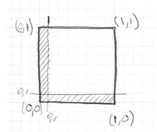
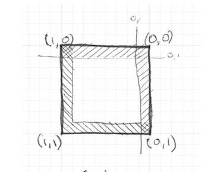

### 绘制一个正方形

```glsl
uniform vec2 u_resolution;

void main(){
    //将当前像素坐标 gl_FragCoord.xy 映射到 [0.0, 1.0] 的范围内，也就是归一化的屏幕坐标：
    //左下角是 (0.0, 0.0)
    //右上角是 (1.0, 1.0)
    vec2 st = gl_FragCoord.xy/u_resolution.xy;
    vec3 color = vec3(0.0);//黑色

    //step函数：
    //如果start.x<0.1 则返回0 否则返回1
    float left = step(0.1,st.x); 
    //如果start.y<0.1 则返回0 否则返回1
    float bottom = step(0.1,st.y); 

    //逻辑与
    //如果 x >= 0.1 且 y >= 0.1，那么 left = 1 且 bottom = 1，left * bottom = 1，最终颜色为白色（1.0, 1.0, 1.0）；
    //否则结果为黑色，
    color = vec3( left * bottom );

    gl_FragColor = vec4(color,1.0);
}
```

分析上述例子：
坐标系说明：
左下角 (0,0)，右上角 (1,1)，图像区域归一化到 [0,1]×[0,1]

图像渲染结果示意图（█ 表示白色区域，░ 表示黑色区域）：




到目前位置，仅仅绘制了一半的边框，现在利用反转st坐标实现类似于翻页的效果
```glsl
//下方和左边
//等同于  float left = step(0.1,st.x);  float bottom = step(0.1,st.y);  
vec2 bl = step(vec2(0.1),st);      

//上方和右边
vec2 tr = step(vec2(0.1),1.0-st);   
color = vec3(bl.x * bl.y * tr.x * tr.y);
```



练习1：改变矩形大小
```glsl
vec2 bl = step(vec2(0.2),st);  
vec2 tr = step(vec2(0.2),1.0-st);   
color = vec3(bl.x * bl.y * tr.x * tr.y);
```

练习2：使用smoothstep实现边缘模糊过渡效果
```glsl
void main(){
    vec2 st = gl_FragCoord.xy / u_resolution.xy;
    vec3 color = vec3(0.0);

    // 软边界范围设置：smoothstep(edge0, edge1, x)
    // 在 edge0 到 edge1 之间平滑过渡，之外为0或1
    //smoothstep(a, b, x) 会根据 x 的值在 a 和 b 之间平滑插值输出，返回值范围是 [0.0, 1.0]：
    //当 x <= a 时，返回 0.0
    //当 x >= b 时，返回 1.0
    //当 a < x < b 时，返回一个平滑从 0 到 1 的插值值，使用三次 Hermite 插值公式
    float left   = smoothstep(0.1, 0.2, st.x);
    float right  = smoothstep(0.1, 0.2, 1.0 - st.x);
    float bottom = smoothstep(0.1, 0.2, st.y);
    float top    = smoothstep(0.1, 0.2, 1.0 - st.y);

    // 组合四个边的平滑裁剪区域
    float mask = left * right * bottom * top;
    color = vec3(mask);

    gl_FragColor = vec4(color, 1.0);
}
```


