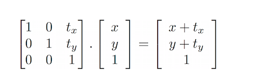
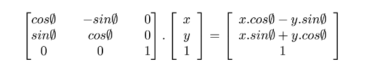
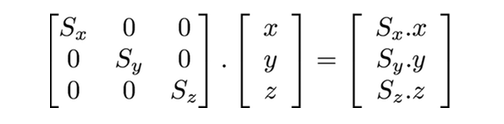
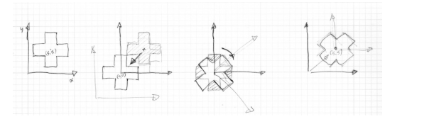
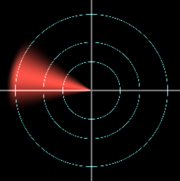

### 矩阵
GLSL 原生支持二维、三维和四维矩阵，分别用mat2,mat3,mat4表示


#### 变换

- 二维平移：❗ 二维平移不是线性变换，不能用 mat2 实现，需要引入 齐次坐标，即用 vec3 表示点，用 mat3 表示变换矩阵。
    - 
    - ```glsl
        mat3 translate2d(vec2 offset) {
            return mat3(
                1.0, 0.0, 0.0,
                0.0, 1.0, 0.0,
                offset.x, offset.y, 1.0
            );
        }
      ```

- 二维旋转：
    - 
    -  ```glsl
        mat2 rotate2d(float _angle){
            return mat2(cos(_angle),-sin(_angle),
                      sin(_angle),cos(_angle));
        }
        ```

- 二维缩放：
    - 
    - ```glsl
        mat2 scale(vec2 _scale){
             return mat2(_scale.x,0.0,0.0,_scale.y);
        }
      ```

- 画布中心绘制：
    - 在旋转空间之前，将形状 移动center到vec2(0.0)坐标系，旋转空间，最后将其移回原始位置。

- 流程类似于：先移动至0,0,  经过计算得到想要的结果， 然后移动到原始位置
    - 

>旋转示例：
```glsl
#define PI 3.14159265359
uniform vec2 u_resolution;
uniform float u_time;
mat2 rotate2d(float angle){
    //二维旋转矩阵 旋转角度为_angle
    return mat2(cos(angle),-sin(angle),
                sin(angle),cos(angle));
}

float box(in vec2 st, in vec2 size){
    size = vec2(0.5) - size*0.5; //目标矩形的宽高 是为了将 box 放到 [0, 1] 空间的正中心。
    
    //这两句组合构造一个 软边缘矩形（盒子），使用 smoothstep 形成平滑边缘过渡。
    vec2 uv = smoothstep(size, size+vec2(0.001), st);
    uv *= smoothstep(size,size+vec2(0.001),  vec2(1.0)-st);
    //只有在矩形范围内时才返回接近 1 的值，越靠近边缘越小。
    return uv.x*uv.y;
}


//用两个矩形叠加：
//一条横向矩形（长宽比 4:1）
//一条纵向矩形（长宽比 1:4）
形成一个正中心对齐的 十字形（Cross）图案。
float cross(in vec2 st, float size){
    return  box(st, vec2(size,size/4.)) + box(st, vec2(size/4.,size));
}

void main(){
    vec2 st = gl_FragCoord.xy/u_resolution.xy;
    vec3 color = vec3(0.0);

    //移动中心点为 0，0
    st -= vec2(0.5);
    //随时间旋转（角度是 sin 曲线震荡）
    st = rotate2d( sin(u_time)*PI ) * st;
    //再移回 [0,1] 坐标中心
    st += vec2(0.5);

    color += vec3(cross(st,0.4));
    gl_FragColor = vec4(color,1.0);
}

```

>缩放示例：

```glsl
#define PI 3.14159265359

uniform vec2 u_resolution;
uniform float u_time;

//缩放矩阵 不含齐次坐标
mat2 scale(vec2 _scale){
    return mat2(_scale.x,0.0,
                0.0,_scale.y);
}

 //二维旋转矩阵 旋转角度为_angle
mat2 rotate2d(float angle){
    return mat2(cos(angle),-sin(angle),
                sin(angle),cos(angle));
}

float box(in vec2 st, in vec2 size){
    size = vec2(0.5) - size*0.5;
    vec2 uv = smoothstep(size, size+vec2(0.001), st);
    uv *= smoothstep(size, size+vec2(0.001), vec2(1.0)-st);
    return uv.x*uv.y;
}

float cross(in vec2 st, float size){
    return  box(st, vec2(size,size/4.)) +
            box(st, vec2(size/4.,size));
}

void main(){
    vec2 st = gl_FragCoord.xy/u_resolution.xy;
    vec3 color = vec3(0.0);

    st -= vec2(0.5); //移动原点到（0，0）
    // st = scale( vec2(sin(u_time)+1.0))*rotate2d(u_time)* st; 缩放加旋转
    // 如果想加入平移，则需要使用齐次坐标 在二维情况时使用mat3进行计算
    st = scale( vec2(sin(u_time)+1.0) ) * st;//缩放


    st += vec2(0.5);// 恢复位置
    color += vec3(cross(st,0.2));
    gl_FragColor = vec4(color,1.0);
}
```


#### 练习（雷达扫描示例）

```glsl
uniform vec2 u_resolution;
uniform float u_time;
// 将像素坐标归一化并转换为以中心为原点
vec2 normalizeCoord(vec2 st) {
    st = st / u_resolution;
    st = st * 2.0 - 1.0;
    st.x *= u_resolution.x / u_resolution.y;
    
    //x: [-aspect, aspect]（aspect = u_resolution.x / u_resolution.y）
	 // y: [-1, 1] 
    // 原点： 0,0 画布中心
    return st;
}

mat2 rotate2d(float _angle){
    return mat2(cos(_angle),-sin(_angle),
                sin(_angle),cos(_angle));
}

// 画圆环（可用于描边圈）
float drawRing(vec2 st, float radius, float width) {
    st = rotate2d(u_time) * st;
    float len = length(st);
    return smoothstep(radius + width, radius + width * 0.5, len) -
         smoothstep(radius - width * 0.5, radius - width, len);
}

//静态点
float drawPoint(vec2 st){
    float d = distance(st,vec2(.5,.5));
    float size=sin(u_time*3.0);
    float dot = 1.0 - step(0.05 * size, d);
    return dot;
}

//画交叉线
float drawCross(vec2 st, float thickness) {
   // 水平线：|st.y| < thickness
    float horiz = 1.0 - smoothstep(thickness * 0.9, thickness, abs(st.y));
    // 垂直线：|st.x| < thickness
    float vert = 1.0 - smoothstep(thickness * 0.9, thickness, abs(st.x));
    return max(horiz, vert);
}

// 雷达扫描扇形
float radarSweep(vec2 st, float radius) {
    float angle = atan(st.y, st.x);
    if (angle < 0.0) angle += 2.0 * PI;

    float sweep = mod(u_time * 1.0, 2.0 * PI); // 扫描角
    float diff = abs(mod(angle - sweep + PI, 2.0 * PI) - PI); // 环绕处理

    float sweepWidth = radians(30.0); // 30度 = 0.523弧度
    float sweepMask = smoothstep(sweepWidth, 0.0, diff);

    float dist = length(st);
    return sweepMask * smoothstep(radius, radius - 0.1, dist);
}


void main() {
    vec2 st = normalizeCoord(gl_FragCoord.xy);
    vec3 color = vec3(0.0);
   color += drawCross(st, 0.005) * vec3(.5);
    // 背景圆环
    color += drawRing(st, 0.3, 0.003) * vec3(0.5, 1.0, 1.0);
    color += drawRing(st, 0.504, 0.003) * vec3(0.5, 1.0, 1.0);
    color += drawRing(st, 0.796, 0.003) * vec3(0.5, 1.0, 1.0);
    color += drawPoint(st) * vec3(1.0, .0, .0)

    // 扫描区域
    color += radarSweep(st, 0.9) * vec3(1.000,0.326,0.278);

    gl_FragColor = vec4(color, 1.0);
}
```

效果图：




