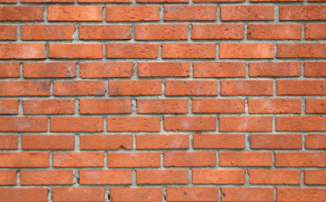
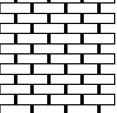
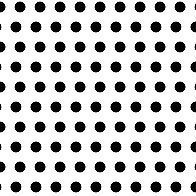
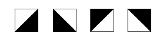
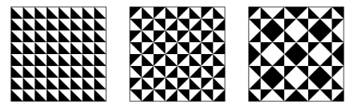
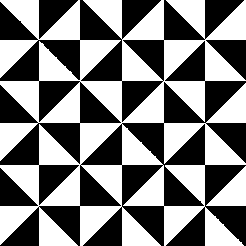
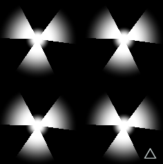

### 图案
Patterns（图案/模式）通常指的是 重复的、有规律的视觉元素或结构

>基于空间坐标（介于 0.0 和 1.0 之间）的乘积，这样我们在 0.0 到 1.0 之间绘制的形状就会重复绘制，形成一个网格。


fract()函数： 返回一个数的小数部分
>fract()本质上是对 1 取模（mod(x,1.0)）。换句话说，fract()它返回浮点数之后的数值


如果我们将标准化坐标系放大 
- 比如说放大三倍 我们将获得三个 0-1 之间的线性插值序列：
    - 第一个在 0-1 之间，
    - 第二个为 1-2 之间的浮点数，
    - 第三个为 2-3 之间的浮点数。


```glsl
uniform vec2 u_resolution;
uniform float u_time;

float circle(in vec2 st, in float radius){
    vec2 l = st-vec2(0.5);// 平移坐标，使原点在 (0.5, 0.5)

    // dot(l,l) 等同于 l.x * l.x + l.y * l.y  计算平方距离  性能比distance函数要好
    // *4 缩放因子 
    // l的最大值为0.5  0.5² + 0.5² = 0.5    0.5*4=2.0  
    float dis=dot(l,l)*4.0 
    return 1.0-smoothstep(radius-(radius*0.01), radius+(radius*0.01),dis);
}

void main() {
	vec2 st = gl_FragCoord.xy/u_resolution;
    vec3 color = vec3(0.0);

    st *= 3.0;      //把坐标放大 3 倍，也就是将画布拆成 3x3 = 9 个区块
    st = fract(st); //取小数部分  意思是：无论你在第几个格子，st 都映射到 [0.0 ~ 1.0]  例如我取到的是st=(2.3,2.1) 也是对当做(0.3 0.1)来进行计算


    //颜色输出1
    //将 st.x 映射为红色通道、st.y 映射为绿色通道
    //所以每个小格子里是从左下到右上渐变的彩色网格
    color = vec3(st,0.0);


    //颜色输出2
    //在每个 [0~1] 的格子中心（0.5, 0.5）绘制一个圆  半径为 0.5（铺满整个格子）
    //3x3 排列的白色圆形
    //color = vec3(circle(st,0.5));

	gl_FragColor = vec4(color,1.0);
}
```
#### 

-颜色输出1：
 - 

 -颜色输出2：
 - 


### 使用矩阵完成图案

由于每个细分或单元都是我们已经使用的标准化坐标系的较小版本，因此我们可以对其应用矩阵变换，以便平移、旋转或缩放内部空间。


```glsl
uniform vec2 u_resolution;
uniform float u_time;

#define PI 3.14159265358979323846

vec2 rotate2D(vec2 st, float angle){
    //移动坐标系方便计算 把 (0.5, 0.5) 平移到原点 (0.0, 0.0)
    st -= 0.5;
    // 2D 旋转矩阵 绕原点逆时针旋转45度
    st =  mat2(cos(angle),-sin(angle),
              sin(angle),cos(angle)) * st;
    //恢复坐标系 平移回以 (0.5, 0.5) 为中心的画布
    st += 0.5;
    return st;
}


//让每个 tile 的坐标范围重新归一到 [0, 1]
vec2 tile(vec2 st, float zoom){
    st *= zoom;
    return fract(st);
}

// 绘制一个柔边矩形（box），返回强度值（0.0 ~ 1.0）
float box(vec2 st, vec2 size, float smoothEdges){
    // 将 box 尺寸转换为从中心向边的偏移量
    // 我希望box宽度为0.7，那么这个box中间往左就是0.35，所以如果左边界在0.15 那右边界就在0.85
    /*
    size = 0.5 - size * 0.5
         = 0.5 - 0.7 * 0.5
         = 0.5 - 0.35 = 0.15

    最终的正方形会：
        从坐标 (0.15, 0.15) 开始
        到坐标 (0.85, 0.85) 结束（因为右上角对称）
    */
    size = vec2(0.5)-size*0.5;


    // 计算边缘平滑范围（AA抗锯齿）
    vec2 aa = vec2(smoothEdges*0.5);
    vec2 uv = smoothstep(size,size+aa,st);

    //vec2(1.0) - st 是将坐标“翻转”到右上角
    //再用同样的 smoothstep 判断 1.0 - st.x 是否小于边界（即右上是否在 box 范围内）
    uv *= smoothstep(size,size+aa,vec2(1.0)-st);
    return uv.x*uv.y;


    /*
    无过渡画法
    vec2 halfSize = _size * 0.5;
    vec2 lower = vec2(0.5) - halfSize;
    vec2 upper = vec2(0.5) + halfSize;
    vec2 uv = step(lower, _st) * step(_st, upper);
    return uv.x * uv.y;
    */
}

void main(void){
    vec2 st = gl_FragCoord.xy/u_resolution.xy;
    vec3 color = vec3(0.0);

    // 将画布划分为 4x4 网格块（即 16 个 tile）
    st = tile(st,4.);

    // 将每个 tile 内的坐标绕中心旋转 45 度
    st = rotate2D(st,PI*0.25);
    
    // 绘制一个中心对称、旋转后的柔边矩形，大小为 0.7，边缘柔化程度为 0.01
    color = vec3(box(st,vec2(0.7),0.01));
    // color = vec3(st,0.0);

    gl_FragColor = vec4(color,1.0);
}
```


### 偏移模式

模拟一堵砖墙，发现每隔一行就会发生偏移


要想在程序上实现这种效果：
- 第一步，我们需要知道所在行是奇数还是偶数
  - 方式：使用mod(2.0),0查看结果是否小于1.0
    -  y = mod(x,2.0) < 1.0 ? 0. : 1. ;
    -  y = step(1.0,mod(x,2.0));


```glsl

//砖块排列逻辑
//将 st 坐标系转换成砖块排列的坐标，关键是实现偶数行平移半个单位，形成交错的砖块效果。
vec2 brickTile(vec2 _st, float _zoom){
    _st *= _zoom;//缩放坐标，实现砖块重复  zoom=5 表示在画布上显示 5 行/列砖块。
    /*
      mod(_st.y, 2.0)：计算行号的奇偶性 结果在 [0.0, 2.0) 之间。如果是第0、2、4...行，mod为0；1、3、5...行为1。
      step(1., mod(...))：step(1., 0) = 0，step(1., 1) = 1 结果是：奇数行返回1，偶数行返回0
       * 0.5：当为奇数行时 向右平移0.5实现交错排列
    */
    _st.x += step(1., mod(_st.y,2.0)) * 0.5;

    //返回小数部分 把坐标限制在 [0,1) 范围内
    return fract(_st);
}

//绘制砖块 在 [0,1] 坐标区间内绘制一个矩形
float box(vec2 _st, vec2 _size){
    //把传入的 size（宽高）转为“从中心开始延伸的范围”。
    _size = vec2(0.5)-_size*0.5;
    //实现边缘软过渡，让 _st 从边界平滑变为1。
    vec2(1.0)-_st：镜像判断右边/上边是否在框内。
    vec2 uv = smoothstep(_size,_size+vec2(1e-4),_st);
    uv *= smoothstep(_size,_size+vec2(1e-4),vec2(1.0)-_st);
    
    return uv.x*uv.y;
}

void main(void){
    vec2 st = gl_FragCoord.xy/u_resolution.xy;
    vec3 color = vec3(0.0);


    //拉伸坐标系的纵横比 使其模仿“现代砖块”的纵横比。 215mm x 102.5mm x 65mm
    // st /= vec2(2.15,0.65)/1.5;

    // 将平面坐标变换为 5x5 的砖块排列坐标
    st = brickTile(st,5.0);

    color = vec3(box(st,vec2(0.9)));

    // color = vec3(st,0.0);

    gl_FragColor = vec4(color,1.0);
}
```




改编案例：
```glsl
vec2 brickTile(vec2 _st, float _zoom){
    _st *= _zoom;
    // 往返周期运动偏移（0 <-> 0.5）
    float offset = abs(sin(3.14159 * u_time)) * 1.0;
    // 判断当前是奇数还是偶数行/列
    float dirX = mix(1.0, -1.0, mod(floor(_st.y), 2.0)); // 行号控制 x 偏移方向
    _st.x += dirX * offset;
    return fract(_st);
}

float circle(in vec2 st, in float radius){
    vec2 dist = st-vec2(0.5); 
	return smoothstep(radius-(radius*0.1), 
                       radius+(radius*0.1),
                       dot(dist,dist)*4.0);
}

void main(void){
    vec2 st = gl_FragCoord.xy/u_resolution.xy;
    vec3 color = vec3(0.0);
    st = brickTile(st,10.0);
    color = vec3(circle(st,0.3));
    gl_FragColor = vec4(color,1.0);
}
```

效果：x轴奇偶行往返移动



### 特吕谢瓦片（装饰图案构造方式）

最经典的 Truchet 瓦片是一种： 单元格：正方形瓷砖（tile）

图案内容：
- 左上角连到右下角的曲线（四分之一圆弧）；
- 或者左下角连到右上角的曲线；
- 也可以是 L 形、线条、箭头等图案。
- 然后每个 tile 可以旋转 0° / 90° / 180° / 270° 进行组合
- 
- 通过改变瓷砖上的图案，可以构建无限复杂的设计
  - 

```glsl
#define PI 3.14159265358979323846

uniform vec2 u_resolution;
uniform float u_time;

//围绕中心点旋转
vec2 rotate2D (vec2 _st, float _angle) {
    _st -= 0.5;
    _st =  mat2(cos(_angle),-sin(_angle),
                sin(_angle),cos(_angle)) * _st;
    _st += 0.5;
    return _st;
}

//画布网格转换
vec2 tile (vec2 _st, float _zoom) {
    _st *= _zoom;
    return fract(_st);
}

vec2 rotateTilePattern(vec2 _st){

    //将每个图案区域（3*3）再次拆分为2*2（4象限区域） 此时每块区域坐标为0~2
    _st *= 2.0;

    //区域索引
    //mod(_st.x, 2.0)：取 _st.x 在 tile 内部的 x 坐标对 2 取余，范围落在 [0.0, 2.0) 中
    //区间判断逻辑：step(edge, x) = (x < edge) ? 0.0 : 1.0
    float index = 0.0;
    index += step(1., mod(_st.x,2.0)); // 判断 x 是在 tile 左边 (0~1)，还是右边 (1~2)
    index += step(1., mod(_st.y,2.0))*2.0; // 判断 y 是在 tile 下方 (0~1)，还是上方 (1~2)
    /*
    | index | 区域  | 说明          |
    | ----- | ----- | ------------- |
    | 0     | 左下角 | x < 1, y < 1 |
    | 1     | 右下角 | x ≥ 1, y < 1 |
    | 2     | 左上角 | x < 1, y ≥ 1 |
    | 3     | 右上角 | x ≥ 1, y ≥ 1 |
    */

    //      |
    //  2   |   3
    //      |
    //--------------
    //      |
    //  0   |   1
    //      |

    //将每个像素映射回 0·0~1.0
    _st = fract(_st);

    //根据索引判断旋转角度
    if(index == 1.0){
        // 旋转90度
        _st = rotate2D(_st,PI*0.5);
    } else if(index == 2.0){
        //  旋转-90度
        _st = rotate2D(_st,PI*-0.5);
    } else if(index == 3.0){
        // 旋转180度
        _st = rotate2D(_st,PI);
    }

    return _st;
}

void main (void) {
    vec2 st = gl_FragCoord.xy/u_resolution.xy;
    st = tile(st,3.0);
    st = rotateTilePattern(st);
    st = rotate2D(st,-PI*u_time*0.25);
    //绘制三角形
    //如果 st.y < st.x → 返回 0.0（黑色）
    //如果 st.y ≥ st.x → 返回 1.0（白色）

    gl_FragColor = vec4(vec3(step(st.x,st.y)),1.0);
}

```



>改编案例：
```glsl

#define PI 3.14159265358979323846

uniform vec2 u_resolution;
uniform float u_time;

//旋转矩阵
vec2 rotate2D (vec2 _st, float _angle) {
    _st -= 0.5;
    _st =  mat2(cos(_angle),-sin(_angle),
           sin(_angle),cos(_angle)) * _st;
    _st += 0.5;
    return _st;
}

vec2 tile (vec2 _st, float _zoom) {
    _st *= _zoom;
    return fract(_st);
}

float drawStar(vec2 st, float rOuter, float rInner) {
    st -= 0.500;
    float a = atan(st.y, st.x); 
    float d = length(st);        
    float angle = PI / 1.536;      

    float k = mod(a + PI, angle); 
    float radius = mix(rOuter, rInner, step(angle * 0.484, k));
    return smoothstep(radius * 0.286, radius, d);
}


void main (void) {
    vec2 st = gl_FragCoord.xy/u_resolution.xy;

    st = tile(st,2.0);
	 st = rotate2D(st,PI+u_time);

    float shape = drawStar(st, 0.146, 0.464);
    
    gl_FragColor = vec4(vec3(1.0-shape),1.0);
}

```

