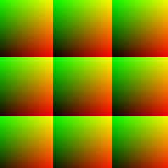
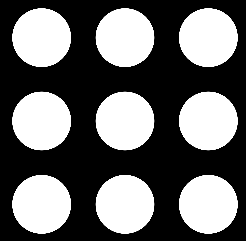
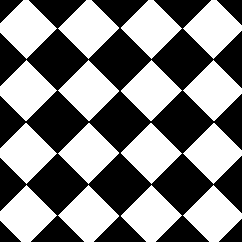

### 图案
Patterns（图案/模式）通常指的是 重复的、有规律的视觉元素或结构

>基于空间坐标（介于 0.0 和 1.0 之间）的乘积，这样我们在 0.0 到 1.0 之间绘制的形状就会重复绘制，形成一个网格。


fract()函数： 返回一个数的小数部分
>fract()本质上是对 1 取模（mod(x,1.0)）。换句话说，fract()它返回浮点数之后的数值


如果我们将标准化坐标系放大 
- 比如说放大三倍 我们将获得三个 0-1 之间的线性插值序列：
    - 第一个在 0-1 之间，
    - 第二个为 1-2 之间的浮点数，
    - 第三个为 2-3 之间的浮点数。


```glsl
uniform vec2 u_resolution;
uniform float u_time;

float circle(in vec2 st, in float radius){
    vec2 l = st-vec2(0.5);// 平移坐标，使原点在 (0.5, 0.5)

    // dot(l,l) 等同于 l.x * l.x + l.y * l.y  计算平方距离  性能比distance函数要好
    // *4 缩放因子 
    // l的最大值为0.5  0.5² + 0.5² = 0.5    0.5*4=2.0  
    float dis=dot(l,l)*4.0 
    return 1.0-smoothstep(radius-(radius*0.01), radius+(radius*0.01),dis);
}

void main() {
	vec2 st = gl_FragCoord.xy/u_resolution;
    vec3 color = vec3(0.0);

    st *= 3.0;      //把坐标放大 3 倍，也就是将画布拆成 3x3 = 9 个区块
    st = fract(st); //取小数部分  意思是：无论你在第几个格子，st 都映射到 [0.0 ~ 1.0]  例如我取到的是st=(2.3,2.1) 也是对当做(0.3 0.1)来进行计算


    //颜色输出1
    //将 st.x 映射为红色通道、st.y 映射为绿色通道
    //所以每个小格子里是从左下到右上渐变的彩色网格
    color = vec3(st,0.0);


    //颜色输出2
    //在每个 [0~1] 的格子中心（0.5, 0.5）绘制一个圆  半径为 0.5（铺满整个格子）
    //3x3 排列的白色圆形
    //color = vec3(circle(st,0.5));

	gl_FragColor = vec4(color,1.0);
}
```
#### 

-颜色输出1：
 - 

 -颜色输出2：
 - 


### 使用矩阵完成图案

由于每个细分或单元都是我们已经使用的标准化坐标系的较小版本，因此我们可以对其应用矩阵变换，以便平移、旋转或缩放内部空间。


```glsl
uniform vec2 u_resolution;
uniform float u_time;

#define PI 3.14159265358979323846

vec2 rotate2D(vec2 st, float angle){
    //移动坐标系方便计算 把 (0.5, 0.5) 平移到原点 (0.0, 0.0)
    st -= 0.5;
    // 2D 旋转矩阵 绕原点逆时针旋转45度
    st =  mat2(cos(angle),-sin(angle),
              sin(angle),cos(angle)) * st;
    //恢复坐标系 平移回以 (0.5, 0.5) 为中心的画布
    st += 0.5;
    return st;
}


//让每个 tile 的坐标范围重新归一到 [0, 1]
vec2 tile(vec2 st, float zoom){
    st *= zoom;
    return fract(st);
}

// 绘制一个柔边矩形（box），返回强度值（0.0 ~ 1.0）
float box(vec2 st, vec2 size, float smoothEdges){
    // 将 box 尺寸转换为从中心向边的偏移量
    // 我希望box宽度为0.7，那么这个box中间往左就是0.35，所以如果左边界在0.15 那右边界就在0.85
    /*
    size = 0.5 - size * 0.5
         = 0.5 - 0.7 * 0.5
         = 0.5 - 0.35 = 0.15

    最终的正方形会：
        从坐标 (0.15, 0.15) 开始
        到坐标 (0.85, 0.85) 结束（因为右上角对称）
    */
    size = vec2(0.5)-size*0.5;


    // 计算边缘平滑范围（AA抗锯齿）
    vec2 aa = vec2(smoothEdges*0.5);
    vec2 uv = smoothstep(size,size+aa,st);

    //vec2(1.0) - st 是将坐标“翻转”到右上角
    //再用同样的 smoothstep 判断 1.0 - st.x 是否小于边界（即右上是否在 box 范围内）
    uv *= smoothstep(size,size+aa,vec2(1.0)-st);
    return uv.x*uv.y;


    /*
    无过渡画法
    vec2 halfSize = _size * 0.5;
    vec2 lower = vec2(0.5) - halfSize;
    vec2 upper = vec2(0.5) + halfSize;
    vec2 uv = step(lower, _st) * step(_st, upper);
    return uv.x * uv.y;
    */
}

void main(void){
    vec2 st = gl_FragCoord.xy/u_resolution.xy;
    vec3 color = vec3(0.0);

    // 将画布划分为 4x4 网格块（即 16 个 tile）
    st = tile(st,4.);

    // 将每个 tile 内的坐标绕中心旋转 45 度
    st = rotate2D(st,PI*0.25);
    
    // 绘制一个中心对称、旋转后的柔边矩形，大小为 0.7，边缘柔化程度为 0.01
    color = vec3(box(st,vec2(0.7),0.01));
    // color = vec3(st,0.0);

    gl_FragColor = vec4(color,1.0);
}
```

