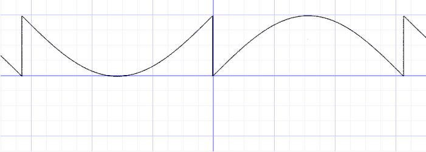
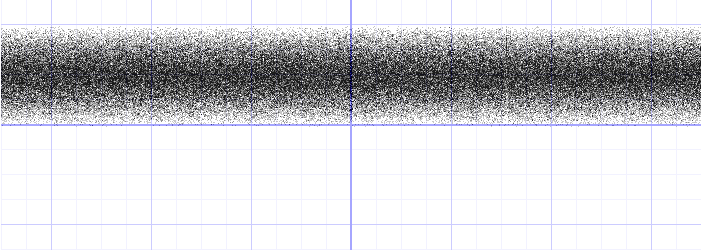
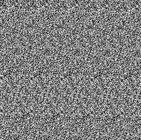
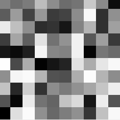
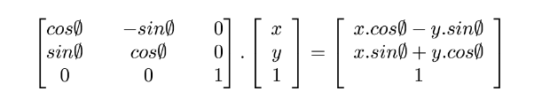
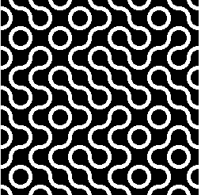
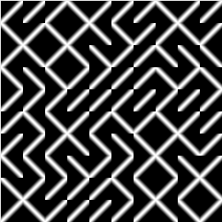
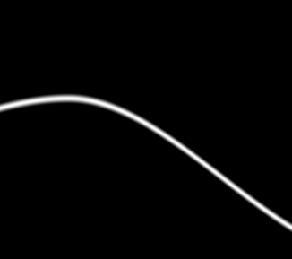
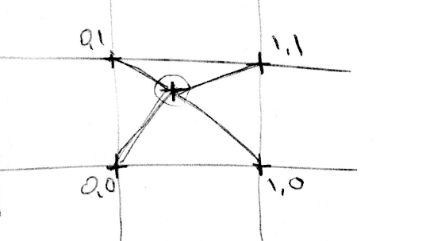
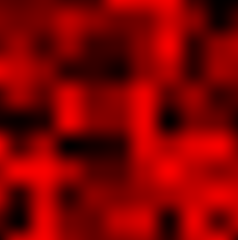

### 颜色

函数分析：

- 
- y = fract(sin(x)*1.0);
- 
- y = fract(sin(x)*100000.0);
- 当达到100000时已经无法再生成正弦波，形成了类似于随机的效果
- ```glsl
    随机函数
    float random (in vec2 _st) {
    return fract(sin(dot(_st.xy,
       vec2(12.9898,78.233)))*
        43758.5453123);
    }
  ```  


### 二维随机

二维随机主要是通过将二维向量转为浮点数

dot:计算向量点积
```glsl
float dot(float x, float y)  
float dot(vec2 x, vec2 y)  
float dot(vec3 x, vec3 y)  
float dot(vec4 x, vec4 y)
```

| 用途       | 描述                                  |
| -------- | ----------------------------------- |
|  判断方向  | 点积 > 0 → 同向，点积 < 0 → 反向             |
|  光照计算  | Lambert 漫反射：`dot(normal, lightDir)` |
|  角度比较  | 用 `dot(a, b) > threshold` 判断夹角范围    |
|  镜面反射  | `reflect()` 内部也会用点积                 |
|  过渡/遮罩 | 可用 `dot()` 做径向渐变、角度扇形遮罩等            |


```glsl
uniform vec2 u_resolution;
uniform vec2 u_mouse;
uniform float u_time;

float random (vec2 st) {
    return fract(sin(dot(st.xy,vec2(12.9898,78.233)))*43758.5453123);
}

void main() {
    vec2 st = gl_FragCoord.xy/u_resolution.xy;

    float rnd = random( st );

    gl_FragColor = vec4(vec3(rnd),1.0);
}

```



### 利用随机

```glsl
uniform vec2 u_resolution;
uniform vec2 u_mouse;
uniform float u_time;

float random (vec2 st) {
    /*
    vec2(12.9898,78.233):12.9898 和 78.233 是常用的“神秘魔法常数”
     打乱输入分布，避免规律性；
     提高伪随机结果的“混乱性”；
     保证每个不同 st 映射到不同的结果。

     求点积目的：将st(x,y)映射为唯一的浮点值
     hash=x×12.9898+y×78.233
     把 2D 坐标投影成 1D 的一个 混合哈希方法。如果用整数点坐标，每个格子都能产生不同的 hash。

     总结：奇异浮点常数 → 非线性混合，打破可预测性。
    */

    return fract(
        sin(dot(st.xy, vec2(12.9898,78.233)))*
        43758.5453123);
}

void main() {
    vec2 st = gl_FragCoord.xy/u_resolution.xy;

    st *= 10.0; //画布坐标 0~1 => 0~10
    vec2 ipos = floor(st);  // 取整数
    vec2 fpos = fract(st);  // 取小数

    //基于整数取随机值
    vec3 color = vec3(random( ipos ));

    gl_FragColor = vec4(color,1.0);
}

```



### 随机图案迷宫
```glsl
//图案旋转逻辑
//根据 tile 的随机值 _index，为每一个 tile 应用不同的变换，从而制造不同方向的对称图案
vec2 truchetPattern(in vec2 _st, in float _index){
    //将输入的随机值 _index ∈ [0, 1) 映射到 [0, 1)，打破偏向性。
    _index = fract(((_index-0.5)*2.0));

    if (_index > 0.75) {
        _st = vec2(1.0) - _st;  // ↙ ↘ ↖ ↗ 全翻转
    } else if (_index > 0.5) {
        _st = vec2(1.0-_st.x,_st.y);  //水平翻转
    } else if (_index > 0.25) {
        _st = 1.0-vec2(1.0-_st.x,_st.y); // 垂直翻转
    }
    return _st;
}

void main() {
    vec2 st = gl_FragCoord.xy/u_resolution.xy;
    //10×10 网格
    st *= 10.0;

    vec2 ipos = floor(st);  // integer
    vec2 fpos = fract(st);  // fraction

    vec2 tile = truchetPattern(fpos, random( ipos ));

    float color = 0.0;

    // 线段 沿着y=x的斜线
    color = smoothstep(tile.x-0.3,tile.x,tile.y) - smoothstep(tile.x,tile.x+0.3,tile.y);


    /*
      圆环
      length(tile):当前像素到0,0的距离   length(vec2(0.3, 0.4)) ≈ 0.5

      step(length(tile), 0.6) - step(length(tile), 0.4) ：差值构造圆环
      当像素到中心的距离在 [0.4, 0.6) 之间，结果为 1.0 否则结果为 0.0


      step(length(tile - vec2(1.0)), 0.6) - step(length(tile - vec2(1.0)), 0.4)：圆心变为1,1，
      
      tile-vec2(1.)：平移

      最终效果：一颗在 tile 的左下角 以 (0, 0) 为中心
                一颗在 tile 的右上角 以 (1, 1) 为中心
                厚度为0.2
     */
    /* 
     color = (step(length(tile),0.6) -
             step(length(tile),0.4) ) +
            (step(length(tile-vec2(1.)),0.6) -
             step(length(tile-vec2(1.)),0.4) );
    */
   

    gl_FragColor = vec4(vec3(color),1.0);
}
```

- 圆环
- 


- 线段
- 

### 噪音


一维随机平滑插值,对两个随机值进行平滑插值，从而获得一个连续变化的随机值函数
```glsl

//伪随机数函数 范围0~1
float rand(float i){
    return fract(sin(i)*10000.0);
}

float i = floor(x);  // 整数
float f = fract(x);  // 小数
//从 rand(i) 平滑过渡到 rand(i+1.0)
//f 应该是 0 到 1 之间的小数，表示当前位置在 i 和 i+1 之间的相对位置。
y = mix(rand(i), rand(i + 1.0), smoothstep(0., 1., f));


/**
  //Hermite 曲线插值函数
  //将 f ∈ [0,1] 之间的线性比例，变成一个平滑（一次导数连续）的插值因子 u
  float u = f * f * (3.0 - 2.0 * f );
  y = mix(rand(i), rand(i + 1.0), u);
 */

```

例子，动态变化的波形：
```glsl
float rand(float x) {
    return fract(sin(x) * 100000.0);
}

float noise(float x) {
    float i = floor(x);
    float f = fract(x);
    float u = f * f * (3.0 - 2.0 * f);
    return mix(rand(i), rand(i + 1.0), u);
}


void main() {
    vec2 uv = gl_FragCoord.xy / u_resolution.xy;
    // 控制噪声横向滚动
    float x = uv.x + u_time;

    // 得到噪声值（Y 坐标）
    float n = noise(x);

    // 在中心画出噪声线（值靠近 n 的地方变亮）
    float y = 1.0 - uv.y;
    float line = smoothstep(0.02, 0., abs(y - n)); // 曲线宽度控制

    gl_FragColor = vec4(vec3(line), 1.0);
}
```
- 


二维噪声：
- 在二维中不会再一条线的两个点取插值（rand(x)和rand(x)+1.0）
- 在平面正方形区域的四个角（rand(st)、rand(st)+vec2(1.,0.)和）rand(st)+vec2(0.,1.)之间进行插值rand(st)+vec2(1.,1.)
- 

三维噪声：
- 在立方体八个角之间进行插值


```glsl

// 2D Random
float random (in vec2 st) {
    return fract(sin(dot(st.xy,
                 vec2(12.9898,78.233)))
                 * 43758.5453123);
}

float noise (in vec2 st) {
    //i: 当前像素的“整数格子坐标”。
    //f: 当前像素在格子内的局部小数偏移，[0,1)。
    vec2 i = floor(st);
    vec2 f = fract(st);

    // 取当前格子四个点的随机值
    /**
      a -- b
      |    |
      c -- d
     */
    float a = random(i);
    float b = random(i + vec2(1.0, 0.0));
    float c = random(i + vec2(0.0, 1.0));
    float d = random(i + vec2(1.0, 1.0));


    //Hermite 曲线插值因子 等价于smoothstep(0.0,1.0,f)
    vec2 u = f*f*(3.0-2.0*f);

    //双线性插值 采用加法 计算更快
    /**
      计算方法：  
      mixX1 = mix(a, b, u.x)     // 左右边上插值
      mixX2 = mix(c, d, u.x)
      final = mix(mixX1, mixX2, u.y)  // 上下插值
     */
    return mix(a, b, u.x) +
            (c - a)* u.y * (1.0 - u.x) +
            (d - b) * u.x * u.y;
}

void main() {
    vec2 st = gl_FragCoord.xy/u_resolution.xy;

    //10*10网格像素坐标
    vec2 pos = vec2(st*10.0);

    //abs(sin(u_time)) 0~1闪烁
    float n = noise(pos)*abs(sin(u_time));
    gl_FragColor = vec4(n,.0,.0, 1.0);
}
```




